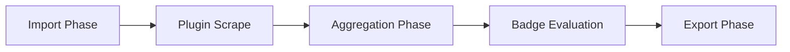

# Aggregates

Aggregates are metrics derived from activities and other data sources. They provide statistical insights at both the organization and contributor levels.

## Types of Aggregates

### Global Aggregates

Global aggregates are organization-level metrics that provide insights across all contributors.

**Examples:**
- Total number of contributors
- Total activities
- Active contributors in the last 30 days

### Contributor Aggregates

Contributor aggregates are per-contributor metrics that provide insights about individual performance.

**Examples:**
- Total activity points
- Activity count
- First/last activity date
- Active days
- Average points per activity

## Aggregate Value Types

Aggregates use a flexible, type-safe value system that supports different data types and formats.

### Number Aggregate

Simple numeric values with optional units and formatting.

```typescript
{
  type: "number",
  value: 42,
  unit: "items",
  format: "integer",
  decimals: 0
}
```

**Format options:**
- `integer` - Whole numbers
- `decimal` - Decimal numbers
- `percentage` - Percentage values (0-100)
- `duration` - Time durations (with unit like "ms", "seconds", "days")
- `bytes` - File sizes
- `currency` - Monetary values

### Number Statistics Aggregate

Detailed statistical metrics for a dataset.

```typescript
{
  type: "statistics/number",
  min: 1,
  max: 100,
  mean: 42.5,
  median: 40,
  variance: 12.3,
  sum: 2125,
  count: 50,
  unit: "points",
  highlightMetric: "mean"
}
```

### String Aggregate

Text-based values.

```typescript
{
  type: "string",
  value: "Active"
}
```

## Standard Aggregates

The system automatically calculates these aggregates during the aggregation phase:

### Global Aggregates

| Slug | Name | Description |
|------|------|-------------|
| `total_contributors` | Total Contributors | Total number of contributors |
| `total_activities` | Total Activities | Total number of activities |
| `active_contributors_last_30d` | Active Contributors (Last 30 Days) | Contributors with activity in the last 30 days |

### Contributor Aggregates

| Slug | Name | Description |
|------|------|-------------|
| `total_activity_points` | Total Activity Points | Sum of all activity points |
| `activity_count` | Activity Count | Total number of activities |
| `first_activity_date` | First Activity Date | Date of first activity |
| `last_activity_date` | Last Activity Date | Date of most recent activity |
| `active_days` | Active Days | Number of unique days with activity |
| `avg_points_per_activity` | Average Points Per Activity | Average points earned per activity |

## Defining Custom Aggregates

Plugins can define custom aggregate definitions during the `setup()` phase.

### In Plugin Setup

```typescript
import { contributorAggregateDefinitionQueries } from "@leaderboard/api";

async setup(ctx: PluginContext) {
  // Define a custom aggregate
  await contributorAggregateDefinitionQueries.upsert(ctx.db, {
    slug: "pr_merged_count",
    name: "PRs Merged",
    description: "Number of pull requests merged",
  });
}
```

## Setting Aggregate Values

Plugins can set custom aggregate values during the `scrape()` phase.

### Simple Number Aggregate

```typescript
import { contributorAggregateQueries } from "@leaderboard/api";

async scrape(ctx: PluginContext) {
  await contributorAggregateQueries.upsert(ctx.db, {
    aggregate: "pr_merged_count",
    contributor: "username",
    value: {
      type: "number",
      value: 42,
      format: "integer",
    },
    meta: {
      source: "github_api",
      calculated_at: new Date().toISOString(),
    },
  });
}
```

### Duration Aggregate

```typescript
await contributorAggregateQueries.upsert(ctx.db, {
  aggregate: "avg_pr_review_time",
  contributor: "username",
  value: {
    type: "number",
    value: 7200000, // 2 hours in milliseconds
    unit: "ms",
    format: "duration",
  },
  meta: { source: "github_api" },
});
```

### Percentage Aggregate

```typescript
await contributorAggregateQueries.upsert(ctx.db, {
  aggregate: "code_review_participation",
  contributor: "username",
  value: {
    type: "number",
    value: 85.5,
    format: "percentage",
    decimals: 1,
  },
  meta: { source: "calculated" },
});
```

### Statistics Aggregate

```typescript
await contributorAggregateQueries.upsert(ctx.db, {
  aggregate: "pr_size_stats",
  contributor: "username",
  value: {
    type: "statistics/number",
    min: 10,
    max: 500,
    mean: 125.5,
    median: 100,
    count: 42,
    unit: "lines",
    highlightMetric: "mean",
  },
  meta: { source: "github_api" },
});
```

## Aggregation Phase

The aggregation phase runs automatically after plugins complete scraping:

1. **Calculate Global Aggregates** - Compute organization-level metrics
2. **Calculate Contributor Aggregates** - Compute per-contributor metrics
3. **Evaluate Badge Rules** - Award badges based on aggregate values

### When Aggregates are Calculated



## Querying Aggregates

### Get All Global Aggregates

```typescript
import { globalAggregateQueries } from "@leaderboard/api";

const aggregates = await globalAggregateQueries.getAll(db);
```

### Get Contributor Aggregates

```typescript
import { contributorAggregateQueries } from "@leaderboard/api";

const aggregates = await contributorAggregateQueries.getByContributor(
  db,
  "username"
);
```

### Get Specific Aggregate

```typescript
const aggregate = await contributorAggregateQueries.getByContributorAndAggregate(
  db,
  "username",
  "total_activity_points"
);

if (aggregate && aggregate.value.type === "number") {
  console.log(`Points: ${aggregate.value.value}`);
}
```

## Data Storage

Aggregates are stored in the data repository for persistence:

```
data/
├── aggregates/
│   ├── global.json              # Global aggregates
│   ├── definitions.json         # Contributor aggregate definitions
│   └── contributors/
│       ├── alice.jsonl          # Alice's aggregates
│       ├── bob.jsonl            # Bob's aggregates
│       └── ...
```

### File Formats

**global.json:**
```json
[
  {
    "slug": "total_contributors",
    "name": "Total Contributors",
    "description": "Total number of contributors",
    "value": {
      "type": "number",
      "value": 42,
      "format": "integer"
    },
    "meta": {
      "calculated_at": "2025-01-05T12:00:00Z"
    }
  }
]
```

**contributors/username.jsonl:**
```jsonl
{"aggregate":"total_activity_points","contributor":"alice","value":{"type":"number","value":1250,"format":"integer"},"meta":{"calculated_at":"2025-01-05T12:00:00Z"}}
{"aggregate":"activity_count","contributor":"alice","value":{"type":"number","value":42,"format":"integer"},"meta":{"calculated_at":"2025-01-05T12:00:00Z"}}
```

## Best Practices

### 1. Use Descriptive Slugs

```typescript
// Good
slug: "pr_merged_count"
slug: "avg_review_time_hours"

// Bad
slug: "metric1"
slug: "data"
```

### 2. Include Units

```typescript
// Good
{
  type: "number",
  value: 7200000,
  unit: "ms",
  format: "duration"
}

// Bad
{
  type: "number",
  value: 7200000
}
```

### 3. Add Metadata

```typescript
meta: {
  source: "github_api",
  calculated_at: new Date().toISOString(),
  api_version: "v3",
}
```

### 4. Handle Missing Data

```typescript
// Check if aggregate exists before using
const aggregate = await contributorAggregateQueries.getByContributorAndAggregate(
  db,
  username,
  "custom_metric"
);

if (!aggregate) {
  // Handle missing aggregate
  return defaultValue;
}
```

### 5. Use Appropriate Types

- Use `number` with `format: "integer"` for counts
- Use `number` with `format: "decimal"` for averages
- Use `number` with `format: "percentage"` for ratios
- Use `statistics/number` for detailed statistical analysis

## See Also

- [Badges](/docs/badges) - Achievement system using aggregates
- [Plugin API Reference](/docs/plugins/api-reference) - Full API documentation
- [Data Management](/docs/data-management) - Data storage and lifecycle

