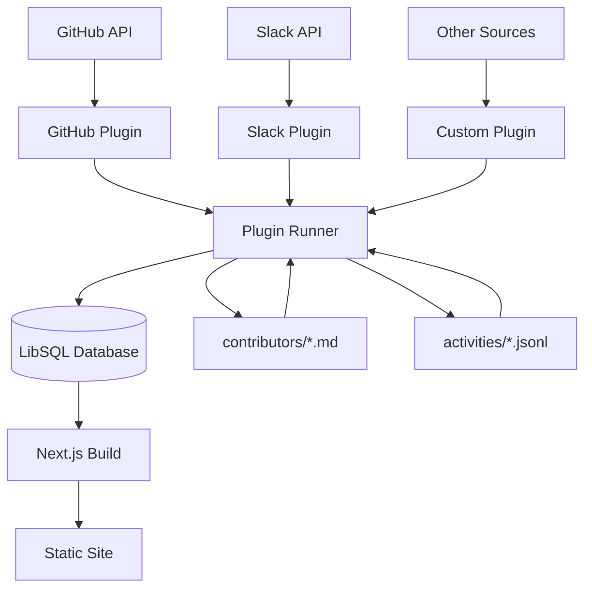
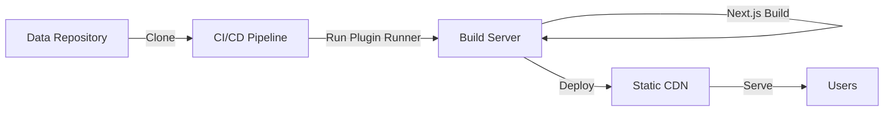

# Architecture

## System Overview

The Leaderboard system follows a build-time data aggregation pattern with static site generation.



## Components

### 1. Plugin Runner (`@leaderboard/plugin-runner`)

**Purpose**: Orchestrate data collection and management

**Responsibilities**:
- Load configuration from `config.yaml`
- Fetch and validate plugins from URLs
- Import existing data from data-repo
- Execute plugin setup and scrape methods
- Export updated data back to data-repo

**CLI Commands**:
```bash
plugin-runner --data-dir=/path/to/data
```

### 2. API Layer (`@ohcnetwork/leaderboard-api`)

**Purpose**: Unified database utilities and plugin type definitions

**Technology**: LibSQL (SQLite-compatible)

**Schema**:
- `contributor` - User profiles and metadata
- `activity_definition` - Activity types defined by plugins
- `activity` - Individual activity records

**Storage**:
- Default location: `${DATA_DIR}/.leaderboard.db`
- Persists `activity_definition` table across runs
- Temporary storage for `contributor` and `activity` tables

**Provides**:
- Database abstraction layer
- Query builders and helpers
- TypeScript type definitions
- Plugin interface specification
- Context object structure

**Example Plugin**:
```typescript
import type { Plugin } from '@ohcnetwork/leaderboard-api';

export default {
  name: 'my-plugin',
  version: '1.0.0',
  async setup(ctx) {
    // Define activity types
  },
  async scrape(ctx) {
    // Fetch and store activities
  },
} satisfies Plugin;
```

### 4. Next.js Application (`apps/leaderboard-web`)

**Purpose**: Generate static website

**Features**:
- Server-Side Generation (SSG) at build time
- Reads data directly from LibSQL database
- Markdown documentation via Fumadocs
- Customizable themes via CSS

**Pages**:
- `/` - Home page with overview
- `/leaderboard` - Rankings and leaderboards
- `/people` - All contributors
- `/[username]` - Individual contributor profiles
- `/docs` - Documentation

## Data Flow

### Build Process

1. **Import Phase**
   ```
   data-repo/contributors/*.md → LibSQL
   data-repo/activities/*.jsonl → LibSQL
   ```

2. **Setup Phase**
   ```
   For each plugin:
     Execute plugin.setup(ctx)
     → Populate activity_definition table
   ```

3. **Scrape Phase**
   ```
   For each plugin:
     Execute plugin.scrape(ctx)
     → Fetch data from API
     → Insert activities into database
   ```

4. **Export Phase**
   ```
   LibSQL → data-repo/contributors/*.md
   LibSQL → data-repo/activities/*.jsonl
   ```

5. **Build Phase**
   ```
   Next.js reads LibSQL
   → Generate static pages
   → Output static site
   ```

## Data Storage Strategies

### Contributors (Markdown Files)

**Format**: Markdown with YAML frontmatter

**Rationale**:
- Human-editable profiles
- Supports rich bio content
- Version control friendly

**Location**: `data-repo/contributors/<username>.md`

### Activities (Sharded JSONL)

**Format**: JSON Lines, one file per contributor

**Rationale**:
- Efficient for large datasets
- Easy per-user updates
- Fast import/export

**Location**: `data-repo/activities/<username>.jsonl`

### Activity Definitions (Database Only)

**Format**: SQLite table

**Rationale**:
- Managed by plugins
- No manual editing needed
- Avoids sync issues

**Location**: `data-repo/.leaderboard.db`

## Deployment Architecture



**Steps**:
1. CI/CD clones data repository
2. Runs plugin-runner to update data
3. Builds Next.js static site
4. Deploys to CDN (Netlify, Vercel, etc.)
5. Users access static site from CDN

## 12-Factor App Compliance

The system follows [12-Factor App](https://12factor.net/) principles:

1. **Codebase**: Single repo, multiple deployments
2. **Dependencies**: Explicitly declared in `package.json`
3. **Config**: Environment variables and `config.yaml`
4. **Backing Services**: LibSQL as attachable resource
5. **Build/Run/Release**: Clear separation of phases
6. **Processes**: Stateless static site
7. **Port Binding**: Not applicable (static export)
8. **Concurrency**: Plugin execution parallelizable
9. **Disposability**: Fast startup, clean shutdown
10. **Dev/Prod Parity**: Same build process everywhere
11. **Logs**: Structured logging in plugin-runner
12. **Admin Processes**: Plugin-runner as separate process

## Security Considerations

### Plugin Execution
- Plugins fetched from configurable URLs
- Basic validation of plugin structure
- Consider using signed plugins in production

### Data Privacy
- All data stored in your infrastructure
- No external data transmission (except plugin API calls)
- Contributor data fully under your control

### Static Site
- No server-side code execution
- No authentication required
- Can be deployed behind authentication if needed

