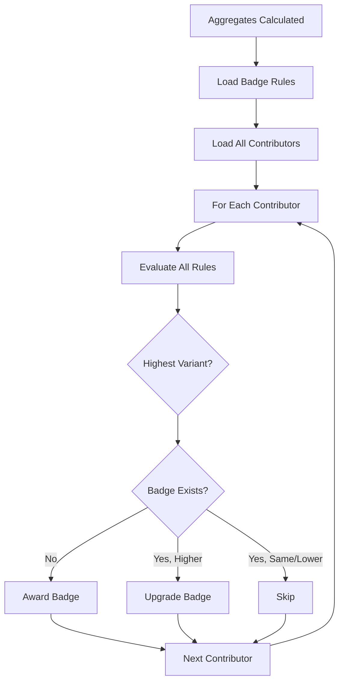

# Badges

Badges are achievements awarded to contributors for reaching specific goals or milestones. They provide gamification and recognition for contributor accomplishments.

## Badge System Overview

### Badge Definitions

A badge definition describes an achievement with multiple variants (levels).

```typescript
{
  slug: "activity_milestone",
  name: "Activity Milestone",
  description: "Awarded for reaching activity count milestones",
  variants: {
    bronze: {
      description: "10+ activities",
      svg_url: "https://example.com/bronze.svg"
    },
    silver: {
      description: "50+ activities",
      svg_url: "https://example.com/silver.svg"
    },
    gold: {
      description: "100+ activities",
      svg_url: "https://example.com/gold.svg"
    }
  }
}
```

### Badge Variants

Variants represent different levels of achievement for the same badge. They are ordered from lowest to highest based on their position in the variants object.

**Common variant names:**
- `bronze` - Entry level
- `silver` - Intermediate level
- `gold` - Advanced level
- `platinum` - Expert level

### Contributor Badges

A contributor badge represents an awarded achievement.

```typescript
{
  slug: "activity_milestone__alice__gold",
  badge: "activity_milestone",
  contributor: "alice",
  variant: "gold",
  achieved_on: "2025-01-05",
  meta: {
    rule_type: "threshold",
    auto_awarded: true,
    threshold: 100,
    actualValue: 125
  }
}
```

## Standard Badges

The system includes these standard badges that are automatically evaluated:

### Activity Milestone

Awarded for reaching activity count milestones.

| Variant | Requirement |
|---------|-------------|
| Bronze | 10+ activities |
| Silver | 50+ activities |
| Gold | 100+ activities |
| Platinum | 500+ activities |

### Points Milestone

Awarded for reaching points milestones.

| Variant | Requirement |
|---------|-------------|
| Bronze | 100+ points |
| Silver | 500+ points |
| Gold | 1,000+ points |
| Platinum | 5,000+ points |

### Consistency Champion

Awarded for maintaining activity streaks.

| Variant | Requirement |
|---------|-------------|
| Bronze | 7 day streak |
| Silver | 14 day streak |
| Gold | 30 day streak |
| Platinum | 90 day streak |

## Badge Auto-Award System

Badges can be automatically awarded based on rules that evaluate contributor aggregates and activities.

### Rule Types

#### 1. Threshold Rules

Award badges when an aggregate value exceeds a threshold.

```typescript
{
  type: "threshold",
  badgeSlug: "activity_milestone",
  enabled: true,
  aggregateSlug: "activity_count",
  thresholds: [
    { variant: "bronze", value: 10 },
    { variant: "silver", value: 50 },
    { variant: "gold", value: 100 }
  ]
}
```

**How it works:**
- Checks the specified aggregate value
- Awards the highest variant where the value meets the threshold
- Automatically upgrades to higher variants as thresholds are met

#### 2. Streak Rules

Award badges for consecutive days of activity.

```typescript
{
  type: "streak",
  badgeSlug: "consistency_champion",
  enabled: true,
  streakType: "daily",
  thresholds: [
    { variant: "bronze", days: 7 },
    { variant: "silver", days: 14 },
    { variant: "gold", days: 30 }
  ]
}
```

**Streak types:**
- `daily` - Consecutive calendar days with activity
- `weekly` - Consecutive weeks with activity
- `monthly` - Consecutive months with activity

#### 3. Composite Rules

Award badges when multiple conditions are met.

```typescript
{
  type: "composite",
  badgeSlug: "early_adopter",
  enabled: true,
  operator: "AND",
  conditions: [
    { aggregateSlug: "contributor_rank_by_join_date", operator: "<=", value: 10 },
    { aggregateSlug: "activity_count", operator: ">=", value: 5 }
  ],
  variant: "gold"
}
```

**Operators:**
- `AND` - All conditions must be true
- `OR` - At least one condition must be true

**Condition operators:**
- `>`, `<`, `>=`, `<=`, `==`, `!=`

#### 4. Custom Rules

Define custom logic for badge awarding.

```typescript
{
  type: "custom",
  badgeSlug: "team_player",
  enabled: true,
  evaluator: (contributor, aggregates, activities) => {
    const prCount = aggregates.get("pr_merged_count");
    const reviewCount = aggregates.get("code_reviews_given");
    
    if (prCount?.type === "number" && reviewCount?.type === "number") {
      const ratio = reviewCount.value / prCount.value;
      if (ratio >= 2.0) {
        return {
          shouldAward: true,
          variant: "gold",
          meta: { reviewToPrRatio: ratio }
        };
      }
    }
    
    return null;
  }
}
```

### Rule Evaluation Process



### Badge Upgrades

When a contributor qualifies for a higher variant:
1. The system checks existing badges
2. Compares variant order (bronze < silver < gold < platinum)
3. Upgrades to the higher variant if qualified
4. Never downgrades existing badges

## Defining Custom Badges

Plugins can define custom badge definitions during the `setup()` phase.

### Basic Badge Definition

```typescript
import { badgeDefinitionQueries } from "@ohcnetwork/leaderboard-api";

async setup(ctx: PluginContext) {
  await badgeDefinitionQueries.upsert(ctx.db, {
    slug: "code_reviewer",
    name: "Code Reviewer",
    description: "Awarded for thorough code reviews",
    variants: {
      bronze: {
        description: "10+ reviews",
        svg_url: "https://example.com/reviewer-bronze.svg",
      },
      silver: {
        description: "50+ reviews",
        svg_url: "https://example.com/reviewer-silver.svg",
      },
      gold: {
        description: "100+ reviews",
        svg_url: "https://example.com/reviewer-gold.svg",
      },
    },
  });
}
```

### Badge with Custom Variants

```typescript
await badgeDefinitionQueries.upsert(ctx.db, {
  slug: "special_contributor",
  name: "Special Contributor",
  description: "Unique achievement",
  variants: {
    unique: {
      description: "One of a kind",
      svg_url: "https://example.com/special.svg",
    },
  },
});
```

## Awarding Badges Manually

Plugins can award badges directly during the `scrape()` phase.

### Award a Badge

```typescript
import { contributorBadgeQueries } from "@ohcnetwork/leaderboard-api";

async scrape(ctx: PluginContext) {
  await contributorBadgeQueries.award(ctx.db, {
    slug: `code_reviewer__alice__bronze`,
    badge: "code_reviewer",
    contributor: "alice",
    variant: "bronze",
    achieved_on: new Date().toISOString().split("T")[0],
    meta: {
      reason: "Completed 10 code reviews",
      source: "github_api",
    },
  });
}
```

### Check if Badge Exists

```typescript
const exists = await contributorBadgeQueries.exists(
  ctx.db,
  "alice",
  "code_reviewer",
  "bronze"
);

if (!exists) {
  // Award the badge
}
```

## Querying Badges

### Get All Badges for a Contributor

```typescript
import { contributorBadgeQueries } from "@ohcnetwork/leaderboard-api";

const badges = await contributorBadgeQueries.getByContributor(db, "alice");

for (const badge of badges) {
  console.log(`${badge.badge} - ${badge.variant}`);
}
```

### Get All Badge Definitions

```typescript
import { badgeDefinitionQueries } from "@ohcnetwork/leaderboard-api";

const definitions = await badgeDefinitionQueries.getAll(db);
```

### Get Specific Badge

```typescript
const badge = await contributorBadgeQueries.getByContributorAndBadge(
  db,
  "alice",
  "activity_milestone"
);

if (badge) {
  console.log(`Current variant: ${badge.variant}`);
}
```

## Data Storage

Badges are stored in the data repository:

```
data/
├── badges/
│   ├── definitions.json         # Badge definitions
│   └── contributors/
│       ├── alice.jsonl          # Alice's badges
│       ├── bob.jsonl            # Bob's badges
│       └── ...
```

### File Formats

**definitions.json:**
```json
[
  {
    "slug": "activity_milestone",
    "name": "Activity Milestone",
    "description": "Awarded for reaching activity count milestones",
    "variants": {
      "bronze": {
        "description": "10+ activities",
        "svg_url": "https://example.com/bronze.svg"
      },
      "silver": {
        "description": "50+ activities",
        "svg_url": "https://example.com/silver.svg"
      }
    }
  }
]
```

**contributors/username.jsonl:**
```jsonl
{"slug":"activity_milestone__alice__gold","badge":"activity_milestone","contributor":"alice","variant":"gold","achieved_on":"2025-01-05","meta":{"rule_type":"threshold","auto_awarded":true}}
{"slug":"consistency_champion__alice__silver","badge":"consistency_champion","contributor":"alice","variant":"silver","achieved_on":"2025-01-03","meta":{"rule_type":"streak","auto_awarded":true}}
```

## Best Practices

### 1. Use Meaningful Badge Names

```typescript
// Good
slug: "code_reviewer"
name: "Code Reviewer"

// Bad
slug: "badge1"
name: "Badge"
```

### 2. Provide Clear Descriptions

```typescript
variants: {
  bronze: {
    description: "10+ code reviews with detailed feedback",
    svg_url: "..."
  }
}
```

### 3. Order Variants Logically

Define variants in order from lowest to highest achievement:

```typescript
variants: {
  bronze: { ... },   // Entry level
  silver: { ... },   // Intermediate
  gold: { ... },     // Advanced
  platinum: { ... }  // Expert
}
```

### 4. Include Metadata

```typescript
meta: {
  reason: "Completed 100 activities",
  achieved_value: 125,
  threshold: 100,
  source: "auto_awarded",
}
```

### 5. Use Consistent SVG URLs

- Host badge images on a reliable CDN
- Use consistent naming conventions
- Consider using generated SVGs for consistency

### 6. Test Badge Rules

Before deploying custom badge rules, test them with sample data to ensure they award correctly.

## Advanced Topics

### Custom Badge Rule Configuration

Badge rules can be configured in `config.yaml`:

```yaml
leaderboard:
  badge_rules:
    activity_milestone:
      enabled: true
      thresholds:
        bronze: 10
        silver: 50
        gold: 100
    
    custom_badge:
      enabled: false  # Disable specific badges
```

### Badge Priority

When multiple rules could award the same badge:
1. All rules are evaluated
2. The highest qualifying variant is selected
3. Existing badges are only upgraded, never downgraded

### Performance Considerations

- Badge evaluation runs after aggregation
- Rules are evaluated for all contributors
- Complex custom rules may impact performance
- Consider caching aggregate values for custom rules

## See Also

- [Aggregates](/docs/aggregates) - Metrics used by badge rules
- [Plugin API Reference](/docs/plugins/api-reference) - Full API documentation
- [Development Guide](/docs/development) - Testing badges locally

