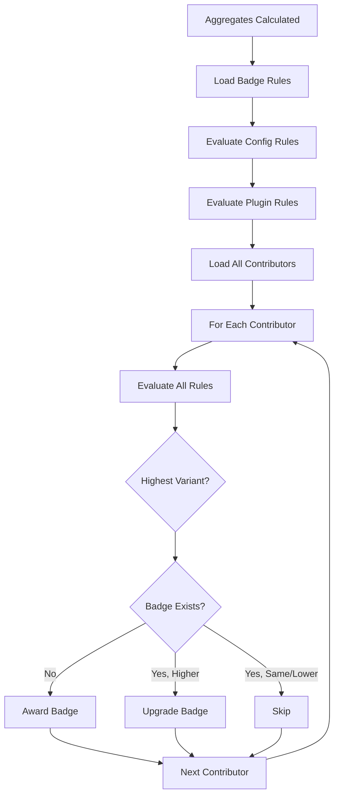

# Badges

Badges are achievements awarded to contributors for reaching specific goals or milestones. They provide gamification and recognition for contributor accomplishments.

## Badge System Overview

### Badge Definitions

A badge definition describes an achievement with multiple variants (levels).

```typescript
{
  slug: "activity_milestone",
  name: "Activity Milestone",
  description: "Awarded for reaching activity count milestones",
  variants: {
    bronze: {
      description: "10+ activities",
      svg_url: "https://example.com/bronze.svg"
    },
    silver: {
      description: "50+ activities",
      svg_url: "https://example.com/silver.svg"
    },
    gold: {
      description: "100+ activities",
      svg_url: "https://example.com/gold.svg"
    }
  }
}
```

### Badge Variants

Variants represent different levels of achievement for the same badge. They are ordered from lowest to highest based on their position in the variants object.

**Common variant names:**

- `bronze` - Entry level
- `silver` - Intermediate level
- `gold` - Advanced level
- `platinum` - Expert level

### Contributor Badges

A contributor badge represents an awarded achievement.

```typescript
{
  slug: "activity_milestone__alice__gold",
  badge: "activity_milestone",
  contributor: "alice",
  variant: "gold",
  achieved_on: "2025-01-05",
  meta: {
    rule_type: "threshold",
    auto_awarded: true,
    threshold: 100,
    actualValue: 125
  }
}
```

## Configuring Badges

Badge definitions and evaluation rules are configured in `config.yaml` under `leaderboard.badges`. This makes badges fully customizable per deployment.

### Example Configuration

```yaml
leaderboard:
  badges:
    definitions:
      - slug: activity_milestone
        name: "Activity Milestone"
        description: "Awarded for reaching activity count milestones"
        variants:
          bronze:
            description: "10+ activities"
            svg_url: "https://example.com/bronze-activity.svg"
          silver:
            description: "50+ activities"
            svg_url: "https://example.com/silver-activity.svg"
          gold:
            description: "100+ activities"
            svg_url: "https://example.com/gold-activity.svg"
          platinum:
            description: "500+ activities"
            svg_url: "https://example.com/platinum-activity.svg"

      - slug: points_milestone
        name: "Points Milestone"
        description: "Awarded for reaching points milestones"
        variants:
          bronze:
            description: "100+ points"
            svg_url: "https://example.com/bronze-points.svg"
          silver:
            description: "500+ points"
            svg_url: "https://example.com/silver-points.svg"
          gold:
            description: "1,000+ points"
            svg_url: "https://example.com/gold-points.svg"

      - slug: consistency_champion
        name: "Consistency Champion"
        description: "Awarded for maintaining activity streaks"
        variants:
          bronze:
            description: "7 day streak"
            svg_url: "https://example.com/bronze-streak.svg"
          silver:
            description: "14 day streak"
            svg_url: "https://example.com/silver-streak.svg"
          gold:
            description: "30 day streak"
            svg_url: "https://example.com/gold-streak.svg"

    rules:
      - type: threshold
        badge_slug: activity_milestone
        enabled: true
        aggregate_slug: activity_count
        thresholds:
          - variant: bronze
            value: 10
          - variant: silver
            value: 50
          - variant: gold
            value: 100
          - variant: platinum
            value: 500

      - type: threshold
        badge_slug: points_milestone
        enabled: true
        aggregate_slug: total_activity_points
        thresholds:
          - variant: bronze
            value: 100
          - variant: silver
            value: 500
          - variant: gold
            value: 1000

      - type: streak
        badge_slug: consistency_champion
        enabled: true
        streak_type: daily
        thresholds:
          - variant: bronze
            days: 7
          - variant: silver
            days: 14
          - variant: gold
            days: 30
```

## Badge Auto-Award System

Badges are automatically awarded based on rules configured in `config.yaml` that evaluate contributor aggregates and activities.

### Rule Types

#### 1. Threshold Rules

Award badges when an aggregate value exceeds a threshold.

```yaml
- type: threshold
  badge_slug: activity_milestone
  enabled: true
  aggregate_slug: activity_count
  thresholds:
    - variant: bronze
      value: 10
    - variant: silver
      value: 50
    - variant: gold
      value: 100
```

**How it works:**

- Checks the specified aggregate value
- Awards the highest variant where the value meets the threshold
- Automatically upgrades to higher variants as thresholds are met

#### 2. Streak Rules

Award badges for consecutive days of activity.

```yaml
- type: streak
  badge_slug: consistency_champion
  enabled: true
  streak_type: daily
  thresholds:
    - variant: bronze
      days: 7
    - variant: silver
      days: 14
    - variant: gold
      days: 30
```

**Streak types:**

- `daily` - Consecutive calendar days with activity
- `weekly` - Consecutive weeks with activity
- `monthly` - Consecutive months with activity

#### 3. Growth Rules

Award badges for improvement over time.

```yaml
- type: growth
  badge_slug: rising_star
  enabled: true
  aggregate_slug: activity_count
  period: month
  thresholds:
    - variant: bronze
      percentage_increase: 25
    - variant: silver
      percentage_increase: 50
    - variant: gold
      percentage_increase: 100
```

#### 4. Composite Rules

Award badges when multiple conditions are met.

```yaml
- type: composite
  badge_slug: early_adopter
  enabled: true
  operator: AND
  conditions:
    - aggregate_slug: contributor_rank_by_join_date
      operator: "<="
      value: 10
    - aggregate_slug: activity_count
      operator: ">="
      value: 5
  variant: gold
```

**Operators:**

- `AND` - All conditions must be true
- `OR` - At least one condition must be true

**Condition operators:**

- `>`, `<`, `>=`, `<=`, `==`, `!=`

#### 5. Custom Rules (Plugin-only)

Plugins can define custom function-based rules via their `badgeRules` manifest property. These cannot be declared in `config.yaml` since they require code.

```typescript
{
  type: "custom",
  badgeSlug: "team_player",
  enabled: true,
  evaluator: (contributor, aggregates, activities) => {
    const prCount = aggregates.get("pr_merged_count");
    const reviewCount = aggregates.get("code_reviews_given");

    if (prCount?.type === "number" && reviewCount?.type === "number") {
      const ratio = reviewCount.value / prCount.value;
      if (ratio >= 2.0) {
        return {
          shouldAward: true,
          variant: "gold",
          meta: { reviewToPrRatio: ratio }
        };
      }
    }

    return null;
  }
}
```

### Rule Evaluation Process


```mermaid
graph TD
    Start[Aggregates Calculated] --> LoadRules[Load Badge Rules]
    LoadRules --> ConfigRules[Evaluate Config Rules]
    ConfigRules --> PluginRules[Evaluate Plugin Rules]
    PluginRules --> LoadContributors[Load All Contributors]
    LoadContributors --> ForEach[For Each Contributor]
    ForEach --> EvalRules[Evaluate All Rules]
    EvalRules --> CheckVariant{Highest Variant?}
    CheckVariant --> CheckExisting{Badge Exists?}
    CheckExisting -->|No| Award[Award Badge]
    CheckExisting -->|Yes, Higher| Upgrade[Upgrade Badge]
    CheckExisting -->|Yes, Same/Lower| Skip[Skip]
    Award --> Next[Next Contributor]
    Upgrade --> Next
    Skip --> Next
    Next --> ForEach
```

### Badge Upgrades

When a contributor qualifies for a higher variant:

1. The system checks existing badges
2. Compares variant order (bronze < silver < gold < platinum)
3. Upgrades to the higher variant if qualified
4. Never downgrades existing badges

### Achievement Dates

The `achieved_on` field reflects when the badge criteria was actually met, not when the evaluation ran:

- **Threshold rules on `activity_count`**: The date of the Nth activity that crossed the threshold (sorted chronologically)
- **Threshold rules on `activity_count:<definition>`**: Same as above but filtered to the specific activity type
- **Threshold rules on `total_activity_points`**: The date of the activity whose cumulative points first exceeded the threshold
- **Streak rules**: The end date of the qualifying streak
- **Other rules** (composite, growth, custom, or unknown aggregates): Falls back to the current date when evaluation runs

When a badge is upgraded to a higher variant, the `achieved_on` date is updated to reflect when the higher threshold was crossed.

## Defining Custom Badges

Plugins can define custom badge definitions and evaluation rules declaratively via the plugin manifest, or imperatively during the `setup()` phase.

### Declarative Badge Definitions (Recommended)

Define badge definitions and rules directly on the plugin object:

```typescript
import type {
  Plugin,
  BadgeDefinition,
  BadgeRuleDefinition,
} from "@ohcnetwork/leaderboard-api";

export default {
  name: "my-plugin",
  version: "1.0.0",
  badgeDefinitions: [
    {
      slug: "code_reviewer",
      name: "Code Reviewer",
      description: "Awarded for thorough code reviews",
      variants: {
        bronze: {
          description: "10+ reviews",
          svg_url: "https://example.com/reviewer-bronze.svg",
        },
        silver: {
          description: "50+ reviews",
          svg_url: "https://example.com/reviewer-silver.svg",
        },
        gold: {
          description: "100+ reviews",
          svg_url: "https://example.com/reviewer-gold.svg",
        },
      },
    },
  ],
  badgeRules: [
    {
      type: "threshold",
      badgeSlug: "code_reviewer",
      enabled: true,
      aggregateSlug: "code_review_count",
      thresholds: [
        { variant: "bronze", value: 10 },
        { variant: "silver", value: 50 },
        { variant: "gold", value: 100 },
      ],
    },
  ],
  async scrape(ctx) {
    /* ... */
  },
} satisfies Plugin;
```

Badge definitions from the manifest are automatically inserted during the **setup** phase. Badge rules are automatically evaluated during the **evaluate** phase, after config badge rules.

### Imperative Badge Definition

Alternatively, define badges in the `setup()` method:

```typescript
import { badgeDefinitionQueries } from "@ohcnetwork/leaderboard-api";

async setup(ctx: PluginContext) {
  await badgeDefinitionQueries.upsert(ctx.db, {
    slug: "code_reviewer",
    name: "Code Reviewer",
    description: "Awarded for thorough code reviews",
    variants: {
      bronze: {
        description: "10+ reviews",
        svg_url: "https://example.com/reviewer-bronze.svg",
      },
      silver: {
        description: "50+ reviews",
        svg_url: "https://example.com/reviewer-silver.svg",
      },
      gold: {
        description: "100+ reviews",
        svg_url: "https://example.com/reviewer-gold.svg",
      },
    },
  });
}
```

### Badge with Custom Variants

```typescript
await badgeDefinitionQueries.upsert(ctx.db, {
  slug: "special_contributor",
  name: "Special Contributor",
  description: "Unique achievement",
  variants: {
    unique: {
      description: "One of a kind",
      svg_url: "https://example.com/special.svg",
    },
  },
});
```

## Awarding Badges Manually

Plugins can award badges directly during the `scrape()` phase.

### Award a Badge

```typescript
import { contributorBadgeQueries } from "@ohcnetwork/leaderboard-api";

async scrape(ctx: PluginContext) {
  await contributorBadgeQueries.award(ctx.db, {
    slug: `code_reviewer__alice__bronze`,
    badge: "code_reviewer",
    contributor: "alice",
    variant: "bronze",
    achieved_on: new Date().toISOString().split("T")[0],
    meta: {
      reason: "Completed 10 code reviews",
      source: "github_api",
    },
  });
}
```

### Check if Badge Exists

```typescript
const exists = await contributorBadgeQueries.exists(
  ctx.db,
  "alice",
  "code_reviewer",
  "bronze",
);

if (!exists) {
  // Award the badge
}
```

## Querying Badges

### Get All Badges for a Contributor

```typescript
import { contributorBadgeQueries } from "@ohcnetwork/leaderboard-api";

const badges = await contributorBadgeQueries.getByContributor(db, "alice");

for (const badge of badges) {
  console.log(`${badge.badge} - ${badge.variant}`);
}
```

### Get All Badge Definitions

```typescript
import { badgeDefinitionQueries } from "@ohcnetwork/leaderboard-api";

const definitions = await badgeDefinitionQueries.getAll(db);
```

### Get Specific Badge

```typescript
const badge = await contributorBadgeQueries.getByContributorAndBadge(
  db,
  "alice",
  "activity_milestone",
);

if (badge) {
  console.log(`Current variant: ${badge.variant}`);
}
```

## Data Storage

Badges are stored in the data repository:

```
data/
├── badges/
│   ├── definitions.json         # Badge definitions
│   └── contributors/
│       ├── alice.jsonl          # Alice's badges
│       ├── bob.jsonl            # Bob's badges
│       └── ...
```

### File Formats

**definitions.json:**

```json
[
  {
    "slug": "activity_milestone",
    "name": "Activity Milestone",
    "description": "Awarded for reaching activity count milestones",
    "variants": {
      "bronze": {
        "description": "10+ activities",
        "svg_url": "https://example.com/bronze.svg"
      },
      "silver": {
        "description": "50+ activities",
        "svg_url": "https://example.com/silver.svg"
      }
    }
  }
]
```

**contributors/username.jsonl:**

```jsonl
{"slug":"activity_milestone__alice__gold","badge":"activity_milestone","contributor":"alice","variant":"gold","achieved_on":"2025-01-05","meta":{"rule_type":"threshold","auto_awarded":true}}
{"slug":"consistency_champion__alice__silver","badge":"consistency_champion","contributor":"alice","variant":"silver","achieved_on":"2025-01-03","meta":{"rule_type":"streak","auto_awarded":true}}
```

## Best Practices

### 1. Use Meaningful Badge Names

```typescript
// Good
slug: "code_reviewer";
name: "Code Reviewer";

// Bad
slug: "badge1";
name: "Badge";
```

### 2. Provide Clear Descriptions

```typescript
variants: {
  bronze: {
    description: "10+ code reviews with detailed feedback",
    svg_url: "..."
  }
}
```

### 3. Order Variants Logically

Define variants in order from lowest to highest achievement:

```typescript
variants: {
  bronze: { ... },   // Entry level
  silver: { ... },   // Intermediate
  gold: { ... },     // Advanced
  platinum: { ... }  // Expert
}
```

### 4. Include Metadata

```typescript
meta: {
  reason: "Completed 100 activities",
  achieved_value: 125,
  threshold: 100,
  source: "auto_awarded",
}
```

### 5. Use Consistent SVG URLs

- Host badge images on a reliable CDN
- Use consistent naming conventions
- Consider using generated SVGs for consistency

### 6. Test Badge Rules

Before deploying custom badge rules, test them with sample data to ensure they award correctly.

## Advanced Topics

### Disabling Badge Rules

You can disable specific rules by setting `enabled: false`:

```yaml
leaderboard:
  badges:
    rules:
      - type: threshold
        badge_slug: activity_milestone
        enabled: false # Disable this rule
        aggregate_slug: activity_count
        thresholds:
          - variant: bronze
            value: 10
```

### Badge Priority

When multiple rules could award the same badge:

1. All rules are evaluated
2. The highest qualifying variant is selected
3. Existing badges are only upgraded, never downgraded

### Performance Considerations

- Badge evaluation runs after aggregation
- Rules are evaluated for all contributors
- Complex custom rules may impact performance
- Consider caching aggregate values for custom rules

## See Also

- [Aggregates](/docs/aggregates) - Metrics used by badge rules
- [Plugin API Reference](/docs/plugins/api-reference) - Full API documentation
- [Development Guide](/docs/development) - Testing badges locally
