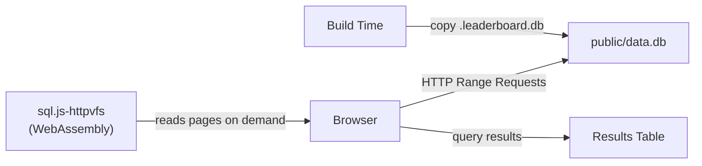

# Data Explorer

The Data Explorer is a browser-based SQL REPL that lets you query the leaderboard database directly from the web interface. The database runs entirely in the browser via WebAssembly — no server required.

## How It Works



During the build, the SQLite database is copied to `public/data.db` as a static asset. When a user visits `/data`, the [sql.js-httpvfs](https://github.com/phiresky/sql.js-httpvfs) library loads a WebAssembly SQLite engine in a Web Worker and makes HTTP range requests to fetch only the database pages needed for each query — the full database is never downloaded unless a query requires a full table scan.

## Accessing the Explorer

Navigate to `/data` in your leaderboard deployment, or click **Data** in the navigation bar.

## Features

### SQL Editor

Write any read-only SQL query against the leaderboard database. The editor supports:

- Multi-line queries
- **Cmd+Enter** (Mac) / **Ctrl+Enter** (Windows/Linux) to execute
- Auto-resizing textarea

### Example Queries

Click any of the preset query buttons to load a starter query:

| Query | Description |
|-------|-------------|
| All contributors | Lists every contributor with username, name, role, and title |
| Top 10 by points | Ranks contributors by total activity points |
| Activity types | Shows all activity definitions and their point values |
| Recent activity | Displays the 20 most recent activities with details |
| Activity per contributor | Aggregates activity count and points per contributor |
| Badge holders | Lists recent badge achievements with variant info |

### Schema Browser

On larger screens, a sidebar displays the full database schema — every table and its columns with types. Click a table name to expand or collapse its column list.

### Query Statistics

After each query, the stats bar shows:

- **Query duration** — how long the SQL execution took
- **Bytes fetched** — total data transferred via HTTP range requests
- **Request count** — number of HTTP requests made to serve the query

## Database Schema

The following tables are available for querying:

### `contributor`

| Column | Type |
|--------|------|
| username | VARCHAR (PK) |
| name | VARCHAR |
| role | VARCHAR |
| title | VARCHAR |
| avatar_url | VARCHAR |
| bio | TEXT |
| social_profiles | JSON |
| joining_date | DATE |
| meta | JSON |

### `activity`

| Column | Type |
|--------|------|
| slug | VARCHAR (PK) |
| contributor | VARCHAR (FK → contributor) |
| activity_definition | VARCHAR (FK → activity_definition) |
| title | VARCHAR |
| occured_at | TIMESTAMP |
| link | VARCHAR |
| text | TEXT |
| points | SMALLINT |
| meta | JSON |

### `activity_definition`

| Column | Type |
|--------|------|
| slug | VARCHAR (PK) |
| name | VARCHAR |
| description | TEXT |
| points | SMALLINT |
| icon | VARCHAR |

### `badge_definition`

| Column | Type |
|--------|------|
| slug | VARCHAR (PK) |
| name | VARCHAR |
| description | TEXT |
| variants | JSON |

### `contributor_badge`

| Column | Type |
|--------|------|
| slug | VARCHAR (PK) |
| badge | VARCHAR (FK → badge_definition) |
| contributor | VARCHAR (FK → contributor) |
| variant | VARCHAR |
| achieved_on | DATE |
| meta | JSON |

### `global_aggregate`

| Column | Type |
|--------|------|
| slug | VARCHAR (PK) |
| name | VARCHAR |
| description | TEXT |
| value | JSON |
| hidden | BOOLEAN |
| meta | JSON |

### `contributor_aggregate_definition`

| Column | Type |
|--------|------|
| slug | VARCHAR (PK) |
| name | VARCHAR |
| description | TEXT |
| hidden | BOOLEAN |

### `contributor_aggregate`

| Column | Type |
|--------|------|
| aggregate | VARCHAR (FK → contributor_aggregate_definition) |
| contributor | VARCHAR (FK → contributor) |
| value | JSON |
| meta | JSON |

## Useful Query Examples

### Contributors with the longest streaks

```sql
SELECT ca.contributor, c.name, ca.value AS streak_days
FROM contributor_aggregate ca
JOIN contributor c ON ca.contributor = c.username
WHERE ca.aggregate = 'longest_streak'
ORDER BY CAST(ca.value AS INTEGER) DESC
LIMIT 10;
```

### Activity breakdown by type

```sql
SELECT ad.name, COUNT(*) AS count, SUM(a.points) AS total_points
FROM activity a
JOIN activity_definition ad ON a.activity_definition = ad.slug
GROUP BY a.activity_definition
ORDER BY total_points DESC;
```

### Monthly activity trend

```sql
SELECT strftime('%Y-%m', occured_at) AS month,
       COUNT(*) AS activities,
       SUM(points) AS points
FROM activity
GROUP BY month
ORDER BY month;
```

### Contributors who earned a specific badge

```sql
SELECT cb.contributor, c.name, cb.variant, cb.achieved_on
FROM contributor_badge cb
JOIN contributor c ON cb.contributor = c.username
WHERE cb.badge = 'prolific_contributor'
ORDER BY cb.achieved_on;
```

## Technical Details

### Build-Time Setup

The prebuild script (`scripts/setup-db.ts`) copies three files into `public/`:

1. **`data.db`** — the SQLite database from the data directory
2. **`sqlite.worker.js`** — the sql.js-httpvfs Web Worker
3. **`sql-wasm.wasm`** — the SQLite WebAssembly binary (~1.2 MB)

These are wired into `predev` and `prebuild` in `package.json` via the `setup:db` script.

### Client-Side Architecture

The `useDatabase()` hook in `lib/sql-repl/use-database.ts`:

1. Dynamically imports `sql.js-httpvfs` (avoids SSR issues)
2. Calls `createDbWorker` with the static asset URLs
3. Uses `serverMode: "full"` with a `requestChunkSize` of 4096 bytes
4. Exposes `exec(sql)` to run queries and `getStats()` for network metrics
5. Cleans up the Web Worker on component unmount

### Performance

- **Lazy loading**: Only database pages touched by a query are fetched
- **Worker thread**: Queries run in a Web Worker, keeping the UI responsive
- **Indexed queries**: Queries using indexed columns (`contributor`, `occured_at`, `activity_definition`) are fast even on large databases
- **Full table scans**: Queries like `SELECT * FROM activity` will fetch the entire table — use `LIMIT` for large tables

### Limitations

- **Read-only**: You can run `INSERT` or `UPDATE` statements but they only affect the in-memory copy and are lost on page reload
- **SQLite dialect**: Uses SQLite SQL syntax, not PostgreSQL or MySQL
- **Memory**: The fetched database pages are kept in memory — very large databases may cause high memory usage
- **No persistence**: Query history is not saved between sessions
