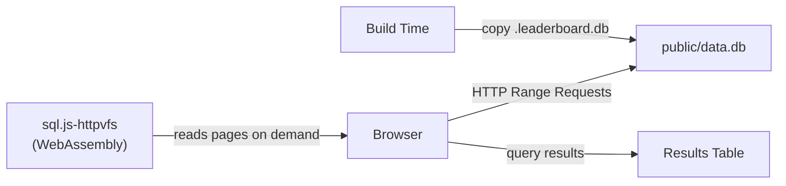

# Data Explorer

The Data Explorer is a browser-based SQL REPL that lets you query the leaderboard database directly from the web interface. The database runs entirely in the browser via WebAssembly — no server required.

## Configuration

The Data Explorer is enabled by default. You can configure it in `config.yaml` under the `leaderboard` section:

```yaml
leaderboard:
  data_explorer:
    enabled: true # optional, default: true
    source: /data.db # optional, default: "/data.db"
```

### Disabling the Data Explorer

Set `enabled: false` to hide the Data Explorer from the navigation and return a 404 for `/data`:

```yaml
leaderboard:
  data_explorer:
    enabled: false
```

### Using an External Database Source

If your database file exceeds the static hosting provider's file size limit (e.g., Cloudflare Pages has a 25 MiB per-file limit), you can host the `.db` file separately and point to it with the `source` option:

```yaml
leaderboard:
  data_explorer:
    source: https://data.leaderboard.yourorg.com/data.db
```

When `source` is an external URL (`http://` or `https://`), the prebuild step skips copying the `.db` file into `public/`, keeping the deployment bundle small. The WebAssembly worker and WASM files are still shipped locally since they are small and always required.

> **Cross-origin hosting requires proper CORS headers.** The external host must expose `Accept-Ranges`, `Content-Range`, and `Content-Length` response headers for range requests to work. [Cloudflare R2](#hosting-the-database-on-cloudflare-r2) is the recommended option. See the [GitHub Pages CORS limitation](#cors-limitation) for details on why some hosts don't work cross-origin.

## How It Works



During the build, the SQLite database is copied to `public/data.db` as a static asset. When a user visits `/data`, the [sql.js-httpvfs](https://github.com/phiresky/sql.js-httpvfs) library loads a WebAssembly SQLite engine in a Web Worker and makes HTTP range requests to fetch only the database pages needed for each query — the full database is never downloaded unless a query requires a full table scan.

## Accessing the Explorer

Navigate to `/data` in your leaderboard deployment, or click **Data** in the navigation bar.

## Features

### SQL Editor

Write any read-only SQL query against the leaderboard database. The editor supports:

- Multi-line queries
- **Cmd+Enter** (Mac) / **Ctrl+Enter** (Windows/Linux) to execute
- Auto-resizing textarea

### Example Queries

Click any of the preset query buttons to load a starter query:

| Query                    | Description                                                  |
| ------------------------ | ------------------------------------------------------------ |
| All contributors         | Lists every contributor with username, name, role, and title |
| Top 10 by points         | Ranks contributors by total activity points                  |
| Activity types           | Shows all activity definitions and their point values        |
| Recent activity          | Displays the 20 most recent activities with details          |
| Activity per contributor | Aggregates activity count and points per contributor         |
| Badge holders            | Lists recent badge achievements with variant info            |

### Schema Browser

On larger screens, a sidebar displays the full database schema — every table and its columns with types. Click a table name to expand or collapse its column list.

### Query Statistics

After each query, the stats bar shows:

- **Query duration** — how long the SQL execution took
- **Bytes fetched** — total data transferred via HTTP range requests
- **Request count** — number of HTTP requests made to serve the query

## Database Schema

The following tables are available for querying:

### `contributor`

| Column          | Type         |
| --------------- | ------------ |
| username        | VARCHAR (PK) |
| name            | VARCHAR      |
| role            | VARCHAR      |
| title           | VARCHAR      |
| avatar_url      | VARCHAR      |
| bio             | TEXT         |
| social_profiles | JSON         |
| joining_date    | DATE         |
| meta            | JSON         |

### `activity`

| Column              | Type                               |
| ------------------- | ---------------------------------- |
| slug                | VARCHAR (PK)                       |
| contributor         | VARCHAR (FK → contributor)         |
| activity_definition | VARCHAR (FK → activity_definition) |
| title               | VARCHAR                            |
| occurred_at         | TIMESTAMP                          |
| link                | VARCHAR                            |
| text                | TEXT                               |
| points              | SMALLINT                           |
| meta                | JSON                               |

### `activity_definition`

| Column      | Type         |
| ----------- | ------------ |
| slug        | VARCHAR (PK) |
| name        | VARCHAR      |
| description | TEXT         |
| points      | SMALLINT     |
| icon        | VARCHAR      |

### `badge_definition`

| Column      | Type         |
| ----------- | ------------ |
| slug        | VARCHAR (PK) |
| name        | VARCHAR      |
| description | TEXT         |
| variants    | JSON         |

### `contributor_badge`

| Column      | Type                            |
| ----------- | ------------------------------- |
| slug        | VARCHAR (PK)                    |
| badge       | VARCHAR (FK → badge_definition) |
| contributor | VARCHAR (FK → contributor)      |
| variant     | VARCHAR                         |
| achieved_on | DATE                            |
| meta        | JSON                            |

### `global_aggregate`

| Column      | Type         |
| ----------- | ------------ |
| slug        | VARCHAR (PK) |
| name        | VARCHAR      |
| description | TEXT         |
| value       | JSON         |
| hidden      | BOOLEAN      |
| meta        | JSON         |

### `contributor_aggregate_definition`

| Column      | Type         |
| ----------- | ------------ |
| slug        | VARCHAR (PK) |
| name        | VARCHAR      |
| description | TEXT         |
| hidden      | BOOLEAN      |

### `contributor_aggregate`

| Column      | Type                                            |
| ----------- | ----------------------------------------------- |
| aggregate   | VARCHAR (FK → contributor_aggregate_definition) |
| contributor | VARCHAR (FK → contributor)                      |
| value       | JSON                                            |
| meta        | JSON                                            |

## Useful Query Examples

### Contributors with the longest streaks

```sql
SELECT ca.contributor, c.name, ca.value AS streak_days
FROM contributor_aggregate ca
JOIN contributor c ON ca.contributor = c.username
WHERE ca.aggregate = 'longest_streak'
ORDER BY CAST(ca.value AS INTEGER) DESC
LIMIT 10;
```

### Activity breakdown by type

```sql
SELECT ad.name, COUNT(*) AS count, SUM(a.points) AS total_points
FROM activity a
JOIN activity_definition ad ON a.activity_definition = ad.slug
GROUP BY a.activity_definition
ORDER BY total_points DESC;
```

### Monthly activity trend

```sql
SELECT strftime('%Y-%m', occurred_at) AS month,
       COUNT(*) AS activities,
       SUM(points) AS points
FROM activity
GROUP BY month
ORDER BY month;
```

### Contributors who earned a specific badge

```sql
SELECT cb.contributor, c.name, cb.variant, cb.achieved_on
FROM contributor_badge cb
JOIN contributor c ON cb.contributor = c.username
WHERE cb.badge = 'prolific_contributor'
ORDER BY cb.achieved_on;
```

## Hosting the Database on GitHub Pages

If your deployment target has a per-file size limit (e.g., Cloudflare Pages at 25 MiB), or you simply want to decouple the database from the application build, you can serve the `.db` file from GitHub Pages using a GitHub Actions workflow — without ever committing the database file to git.

### Why GitHub Pages?

- **No per-file size limit** — GitHub Pages has a 1 GB total site size limit but no individual file size restriction
- **Supports HTTP Range Requests** — required by `sql.js-httpvfs` for lazy loading
- **Free for public repositories** — ideal for open-source leaderboards
- **No bloated git history** — the workflow uploads the database as a Pages deployment artifact, so the `.db` file never enters version control

### GitHub Actions Workflow

Create `.github/workflows/publish-db.yml` in your leaderboard repository (or data repository):

```yaml
name: Publish Leaderboard Database

on:
  schedule:
    - cron: "0 */6 * * *" # Every 6 hours
  workflow_dispatch: # Manual trigger

permissions:
  contents: read
  pages: write
  id-token: write

concurrency:
  group: pages
  cancel-in-progress: false

jobs:
  build:
    runs-on: ubuntu-latest
    steps:
      - uses: actions/checkout@v4

      - uses: pnpm/action-setup@v4

      - uses: actions/setup-node@v4
        with:
          node-version: 20
          cache: pnpm

      - run: pnpm install

      - name: Build database
        run: pnpm build:data
        env:
          LEADERBOARD_DATA_DIR: ./data
          GITHUB_TOKEN: ${{ secrets.GITHUB_TOKEN }}

      - name: Prepare Pages artifact
        run: |
          mkdir -p _site
          cp data/.leaderboard.db _site/data.db

      - name: Upload Pages artifact
        uses: actions/upload-pages-artifact@v3

  deploy:
    needs: build
    runs-on: ubuntu-latest
    environment:
      name: github-pages
      url: ${{ steps.deployment.outputs.page_url }}
    steps:
      - name: Deploy to GitHub Pages
        id: deployment
        uses: actions/deploy-pages@v4
```

This workflow:

1. Runs the plugin runner to build a fresh database
2. Copies the `.db` file into a `_site/` directory
3. Uploads it as a GitHub Pages artifact (no git commit)
4. Deploys the artifact to GitHub Pages

### Enable GitHub Pages

In your repository, go to **Settings → Pages** and set the source to **GitHub Actions** (not "Deploy from a branch").

### Configure `config.yaml`

Point the Data Explorer to the published URL:

```yaml
leaderboard:
  data_explorer:
    source: https://yourorg.github.io/your-repo/data.db
```

The prebuild step will skip copying `data.db` locally and the browser will fetch it directly from GitHub Pages.

### CORS Limitation

> **Important**: GitHub Pages does not set the `Access-Control-Expose-Headers` response header. When the Data Explorer is hosted on a different origin than the database (cross-origin), the browser strips the `Accept-Ranges` and `Content-Range` headers from responses. This prevents `sql.js-httpvfs` from performing range requests correctly, resulting in a **"database disk image is malformed"** error.
>
> GitHub Pages works only when the leaderboard site and the database are served from the **same origin**. For cross-origin hosting, use [Cloudflare R2](#hosting-the-database-on-cloudflare-r2) or another storage provider that supports configurable CORS headers.

## Hosting the Database on Cloudflare R2

[Cloudflare R2](https://developers.cloudflare.com/r2/) is an object storage service with a generous free tier. It supports configurable CORS policies — making it the recommended option for hosting the database externally, especially when deploying the leaderboard to Cloudflare Pages.

### Why Cloudflare R2?

- **Configurable CORS headers** — you can expose `Accept-Ranges`, `Content-Range`, and `Content-Length`, which are required for cross-origin range requests
- **No per-file size limit** — R2 supports objects up to 5 TB
- **Free tier** — 10 GB storage, 10 million reads/month, 1 million writes/month
- **Native Cloudflare integration** — pairs naturally with Cloudflare Pages deployments
- **Global edge network** — low-latency access worldwide

### Step 1: Create an R2 Bucket

1. Go to the [Cloudflare dashboard](https://dash.cloudflare.com/) → **R2 Object Storage** → **Create bucket**
2. Name it (e.g., `leaderboard-data`)
3. Choose a location hint closest to your users

### Step 2: Enable Public Access

1. Open your bucket → **Settings** → **Public access**
2. Under **Custom Domains**, add a domain (e.g., `data.leaderboard.yourorg.com`) — or use the default R2 public URL by enabling **R2.dev subdomain**

### Step 3: Configure CORS Policy

In your bucket settings, go to **CORS policy** and add the following, replacing the origin with your leaderboard deployment URL:

```json
[
  {
    "AllowedOrigins": ["https://contributors.yourorg.com"],
    "AllowedMethods": ["GET", "HEAD"],
    "AllowedHeaders": ["Range"],
    "ExposeHeaders": ["Accept-Ranges", "Content-Range", "Content-Length"],
    "MaxAgeSeconds": 86400
  }
]
```

This ensures only your leaderboard site can make cross-origin requests to the database. Requests from any other origin will be blocked by the browser.

> **CORS is not full access control.** CORS only prevents other _websites_ from loading the database via JavaScript (`fetch`, `XMLHttpRequest`). It does not prevent direct downloads — anyone with the URL can still access the file via `curl`, a browser address bar, or any non-browser client. If you need to restrict direct access, see [Securing Access with a Cloudflare Worker](#securing-access-with-a-cloudflare-worker) below.

### Step 4: Upload the Database

You can upload manually via the dashboard, or use `wrangler` in CI:

```bash
npx wrangler r2 object put leaderboard-data/data.db \
  --file data/.leaderboard.db \
  --content-type application/octet-stream
```

### Step 5: Configure `config.yaml`

Point the Data Explorer to your R2 URL:

```yaml
leaderboard:
  data_explorer:
    source: https://data.leaderboard.yourorg.com/data.db
```

If using the R2.dev subdomain instead of a custom domain:

```yaml
leaderboard:
  data_explorer:
    source: https://leaderboard-data.<account-id>.r2.dev/data.db
```

### Automating with GitHub Actions

Create `.github/workflows/publish-db.yml` to rebuild and upload the database on a schedule:

```yaml
name: Publish Leaderboard Database to R2

on:
  schedule:
    - cron: "0 */6 * * *" # Every 6 hours
  workflow_dispatch: # Manual trigger

jobs:
  publish:
    runs-on: ubuntu-latest
    steps:
      - uses: actions/checkout@v4

      - uses: pnpm/action-setup@v4

      - uses: actions/setup-node@v4
        with:
          node-version: 20
          cache: pnpm

      - run: pnpm install

      - name: Build database
        run: pnpm build:data
        env:
          LEADERBOARD_DATA_DIR: ./data
          GITHUB_TOKEN: ${{ secrets.GITHUB_TOKEN }}

      - name: Upload to R2
        run: npx wrangler r2 object put leaderboard-data/data.db --file data/.leaderboard.db --content-type application/octet-stream
        env:
          CLOUDFLARE_API_TOKEN: ${{ secrets.CLOUDFLARE_API_TOKEN }}
          CLOUDFLARE_ACCOUNT_ID: ${{ secrets.CLOUDFLARE_ACCOUNT_ID }}
```

Add these secrets to your repository:

- `CLOUDFLARE_API_TOKEN` — create an API token with **R2 write** permissions in the [Cloudflare dashboard](https://dash.cloudflare.com/profile/api-tokens)
- `CLOUDFLARE_ACCOUNT_ID` — found on the R2 overview page

## Technical Details

### Build-Time Setup

The prebuild script (`scripts/setup-db.ts`) copies three files into `public/`:

1. **`data.db`** — the SQLite database from the data directory
2. **`sqlite.worker.js`** — the sql.js-httpvfs Web Worker
3. **`sql-wasm.wasm`** — the SQLite WebAssembly binary (~1.2 MB)

These are wired into `predev` and `prebuild` in `package.json` via the `setup:db` script.

### Client-Side Architecture

The `useDatabase()` hook in `lib/sql-repl/use-database.ts`:

1. Dynamically imports `sql.js-httpvfs` (avoids SSR issues)
2. Calls `createDbWorker` with the static asset URLs
3. Uses `serverMode: "full"` with a `requestChunkSize` of 4096 bytes
4. Exposes `exec(sql)` to run queries and `getStats()` for network metrics
5. Cleans up the Web Worker on component unmount

### Performance

- **Lazy loading**: Only database pages touched by a query are fetched
- **Worker thread**: Queries run in a Web Worker, keeping the UI responsive
- **Indexed queries**: Queries using indexed columns (`contributor`, `occurred_at`, `activity_definition`) are fast even on large databases
- **Full table scans**: Queries like `SELECT * FROM activity` will fetch the entire table — use `LIMIT` for large tables

### Limitations

- **Read-only**: You can run `INSERT` or `UPDATE` statements but they only affect the in-memory copy and are lost on page reload
- **SQLite dialect**: Uses SQLite SQL syntax, not PostgreSQL or MySQL
- **Memory**: The fetched database pages are kept in memory — very large databases may cause high memory usage
- **No persistence**: Query history is not saved between sessions
