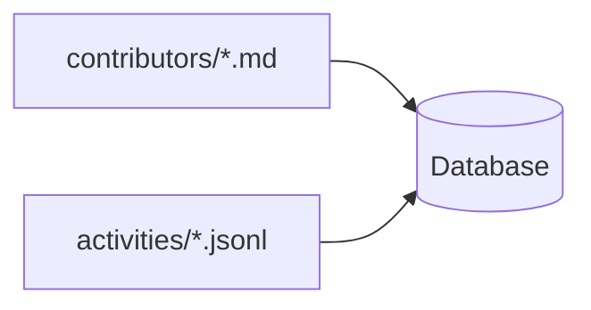
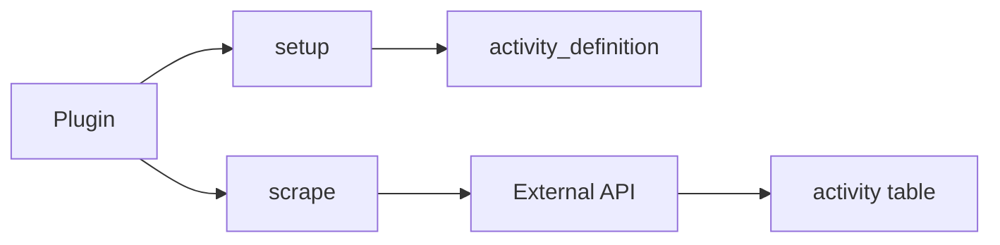
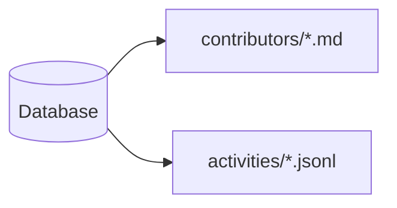
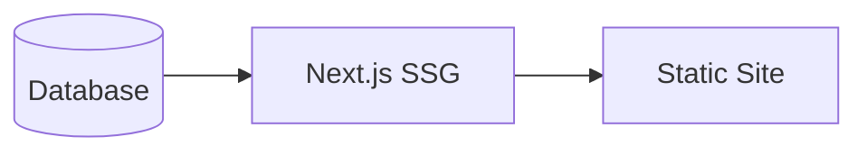

# Data Management

The Leaderboard system uses a hybrid data storage approach for flexibility and maintainability.

## Data Repository Structure

```
data-repo/
├── config.yaml                # Configuration
├── theme.css                  # Custom theme (optional)
├── .leaderboard.db           # LibSQL database
├── contributors/              # Contributor profiles (Markdown)
│   ├── alice.md
│   ├── bob.md
│   └── charlie.md
└── activities/                # Activity records (JSONL)
    ├── alice.jsonl
    ├── bob.jsonl
    └── charlie.jsonl
```

## Storage Strategies

| Data Type | Format | Import | Export | Rationale |
|-----------|--------|--------|--------|-----------|
| Contributors | Markdown + YAML | ✅ | ✅ | Human-editable profiles with rich bio content |
| Activity Definitions | Database only | ❌ | ❌ | Managed by plugins, no manual editing needed |
| Activities | Sharded JSONL | ✅ | ✅ | Efficient for large datasets, easy per-user updates |

## Contributor Profiles

### Format

Markdown files with YAML frontmatter:

```markdown
---
username: alice
name: Alice Smith
role: core
title: Senior Engineer
avatar_url: https://github.com/alice.png
social_profiles:
  github: https://github.com/alice
  linkedin: https://linkedin.com/in/alice
joining_date: 2020-03-15
meta:
  team: backend
  timezone: PST
---

Alice is a senior engineer specializing in backend systems and distributed computing.

She has been contributing to the project since its inception and leads the infrastructure team.

## Expertise

- Kubernetes
- PostgreSQL
- High-performance system design
```

### Schema

**Frontmatter fields**:
- `username` (string, required) - Unique identifier
- `name` (string) - Full name
- `role` (string) - Role identifier (must match `config.yaml`)
- `title` (string) - Job title or designation
- `avatar_url` (string) - Profile picture URL
- `social_profiles` (object) - Social media links
- `joining_date` (string, YYYY-MM-DD) - Join date
- `meta` (object) - Custom metadata

**Content**: Bio in Markdown format

### Manual Editing

Contributors can be added or edited manually:

1. Create/edit file in `contributors/<username>.md`
2. Write frontmatter and bio
3. Commit and push changes
4. Next build will include updates

## Activities

### Format

JSON Lines (JSONL), one file per contributor:

```jsonl
{"slug":"alice-pr-123","contributor":"alice","activity_definition":"pr_merged","title":"Fix auth bug","occured_at":"2024-01-15T10:30:00Z","link":"https://github.com/org/repo/pull/123","points":10}
{"slug":"alice-issue-45","contributor":"alice","activity_definition":"issue_opened","title":"Add rate limiting","occured_at":"2024-01-16T14:20:00Z","link":"https://github.com/org/repo/issues/45","points":5}
```

### Schema

Each line is a JSON object with:
- `slug` (string, required) - Unique identifier
- `contributor` (string, required) - Username
- `activity_definition` (string, required) - Activity type slug
- `title` (string) - Activity title
- `occured_at` (string, required) - ISO 8601 timestamp
- `link` (string) - URL to activity
- `text` (string) - Additional text/description
- `points` (number) - Points awarded
- `meta` (object) - Custom metadata

### Sharding

Activities are sharded by contributor for:
- **Easier updates**: Only update affected user's file
- **Better performance**: Parallel import/export
- **Smaller diffs**: Git history is cleaner
- **Scalability**: Works with thousands of contributors

## Activity Definitions

### Format

SQLite table in `.leaderboard.db`:

```sql
CREATE TABLE activity_definition (
    slug         VARCHAR PRIMARY KEY,
    name         VARCHAR NOT NULL,
    description  TEXT NOT NULL,
    points       SMALLINT,
    icon         VARCHAR
);
```

### Management

Activity definitions are:
- **Created by plugins** during `setup()` phase
- **Persisted** in the database file
- **Not exported** to separate files
- **Recreated** if database is deleted

**Example**:
```javascript
await ctx.db.execute(`
  INSERT OR IGNORE INTO activity_definition 
  (slug, name, description, points, icon)
  VALUES 
  ('pr_merged', 'PR Merged', 'Pull request was merged', 10, 'git-merge')
`);
```

## Database

### LibSQL

**Technology**: SQLite-compatible database with modern features

**Location**: `${DATA_DIR}/.leaderboard.db`

**Purpose**:
- Primary data store during build process
- Efficient querying for SSG
- Persistent storage for activity definitions

### Access

The database is accessed by:
- **Plugin Runner**: Write data during scraping
- **Next.js Build**: Read data for SSG

### Connection

```typescript
import { createDatabase } from '@ohcnetwork/leaderboard-api';

const db = createDatabase('file:./data/.leaderboard.db');
```

## Data Lifecycle

### Import Phase



**Process**:
1. Read all Markdown files from `contributors/`
2. Parse YAML frontmatter and content
3. Insert into `contributor` table
4. Read all JSONL files from `activities/`
5. Parse each line as JSON
6. Insert into `activity` table

### Plugin Phase



**Process**:
1. Execute `setup()` for all plugins
2. Plugins populate `activity_definition` table
3. Execute `scrape()` for all plugins
4. Plugins fetch data from APIs
5. Plugins insert into `activity` table

### Export Phase



**Process**:
1. Read all contributors from database
2. Serialize to Markdown with frontmatter
3. Write to `contributors/<username>.md`
4. Read all activities from database
5. Group by contributor
6. Serialize to JSONL
7. Write to `activities/<username>.jsonl`

### Build Phase



**Process**:
1. Next.js reads from LibSQL database
2. Generate static pages with data
3. Output HTML/CSS/JS files

## Backup & Recovery

### Full Backup

```bash
# Backup entire data repository
tar -czf data-backup-$(date +%Y%m%d).tar.gz data-repo/
```

### Selective Backup

```bash
# Backup only contributors
tar -czf contributors-$(date +%Y%m%d).tar.gz data-repo/contributors/

# Backup only activities
tar -czf activities-$(date +%Y%m%d).tar.gz data-repo/activities/
```

### Recovery

```bash
# Restore from backup
tar -xzf data-backup-20240101.tar.gz
```

### Git History

Since data is in Git:

```bash
# Revert to previous state
git checkout HEAD~1 contributors/alice.md

# View history
git log --follow contributors/alice.md
```

## Data Migration

### From Legacy Format

If migrating from a different system:

```javascript
// migration.js
import { createDatabase, contributorQueries } from '@ohcnetwork/leaderboard-api';
import { exportContributors } from '@leaderboard/plugin-runner';

const db = createDatabase(':memory:');

// Import legacy data
for (const legacyUser of legacyData) {
  await contributorQueries.upsert(db, {
    username: legacyUser.login,
    name: legacyUser.name,
    // ... map fields
  });
}

// Export to new format
await exportContributors(db, './data-repo', logger);
```

### Between Formats

To change activity format:

1. Import activities to database
2. Transform in database
3. Export to new format

## Data Validation

### Automatic Validation

The plugin runner validates:
- Markdown frontmatter structure
- JSON validity in JSONL files
- Foreign key references
- Required fields

### Manual Validation

Check contributor profiles:

```bash
# Check for missing usernames
grep -L "^username:" contributors/*.md

# Validate YAML frontmatter
for f in contributors/*.md; do
  yq e '.' "$f" > /dev/null || echo "Invalid: $f"
done
```

Check activity files:

```bash
# Validate JSON lines
for f in activities/*.jsonl; do
  jq empty "$f" 2>/dev/null || echo "Invalid JSON in: $f"
done
```

## Performance Considerations

### Import Performance

- **Parallel processing**: Contributors and activities imported concurrently
- **Streaming**: Large JSONL files processed line-by-line
- **Batch inserts**: Multiple activities inserted in transactions

### Export Performance

- **Sharded output**: One file per contributor enables parallel export
- **Incremental updates**: Only modified files written
- **Efficient queries**: Database indexes optimize queries

### Database Size

Typical sizes:
- Contributors: ~1 KB per contributor
- Activities: ~200 bytes per activity
- Database overhead: ~100 KB

Example: 100 contributors × 1000 activities = ~20 MB database

## Best Practices

1. **Commit frequently**: Small commits easier to review
2. **Use branches**: Test changes before merging to main
3. **Validate before commit**: Check data integrity
4. **Backup regularly**: Automate backups in CI/CD
5. **Monitor database size**: Archive old activities if needed
6. **Document custom fields**: Explain `meta` field usage

