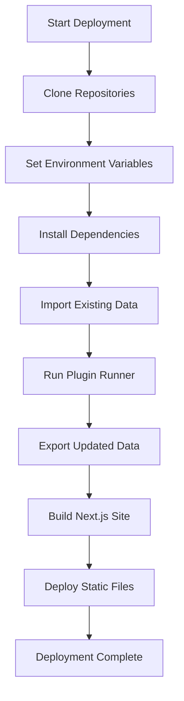

# Deployment Guide

Deploy the Leaderboard system to various hosting platforms.

## Build Process Overview



## Prerequisites

- Node.js v20+ installed
- pnpm v10+ installed
- Access to data repository
- Plugin API credentials (if applicable)

## Environment Variables

Required variables:

```bash
# Data repository location
LEADERBOARD_DATA_DIR=/path/to/data-repo

# Database URL (optional, defaults to file in data-repo)
LIBSQL_DB_URL=file:${LEADERBOARD_DATA_DIR}/.leaderboard.db

# Plugin-specific (if using plugins)
GITHUB_TOKEN=ghp_xxx
SLACK_API_TOKEN=xoxb-xxx

# Build environment
NODE_ENV=production
```

## Manual Deployment

### Step 1: Clone Repositories

```bash
# Clone main repository
git clone https://github.com/yourorg/leaderboard.git
cd leaderboard

# Clone data repository
git clone https://github.com/yourorg/leaderboard-data.git ../leaderboard-data
```

### Step 2: Install Dependencies

```bash
pnpm install
```

### Step 3: Set Environment Variables

```bash
export LEADERBOARD_DATA_DIR=../leaderboard-data
export GITHUB_TOKEN=your_token_here
```

### Step 4: Run Plugin Runner

```bash
pnpm data:scrape
```

This will:
1. Import existing contributors and activities
2. Run plugin setup methods
3. Run plugin scrape methods
4. Export updated data

### Step 5: Build Site

```bash
pnpm build
```

### Step 6: Deploy Static Files

Deploy the contents of `apps/leaderboard-web/out/` to your hosting provider.

## Platform-Specific Guides

### Netlify

#### Netlify.toml

```toml
[build]
  command = "pnpm data:scrape && pnpm build"
  publish = "apps/leaderboard-web/out"

[build.environment]
  NODE_VERSION = "20"
  PNPM_VERSION = "10"

[[redirects]]
  from = "/*"
  to = "/index.html"
  status = 200
```

#### Deploy

```bash
# Install Netlify CLI
npm install -g netlify-cli

# Login
netlify login

# Deploy
netlify deploy --prod
```

#### Environment Variables

Set in Netlify dashboard:
- `LEADERBOARD_DATA_DIR` → `/opt/build/repo/../leaderboard-data`
- `GITHUB_TOKEN` → (your token)
- Other plugin-specific variables

### Vercel

#### vercel.json

```json
{
  "buildCommand": "pnpm data:scrape && pnpm build",
  "outputDirectory": "apps/leaderboard-web/out",
  "installCommand": "pnpm install"
}
```

#### Deploy

```bash
# Install Vercel CLI
npm install -g vercel

# Login
vercel login

# Deploy
vercel --prod
```

#### Environment Variables

Set via Vercel dashboard or CLI:

```bash
vercel env add LEADERBOARD_DATA_DIR
vercel env add GITHUB_TOKEN
```

### GitHub Pages

#### GitHub Actions Workflow

Create `.github/workflows/deploy.yml`:

```yaml
name: Deploy to GitHub Pages

on:
  push:
    branches: [main]
  workflow_dispatch:

permissions:
  contents: read
  pages: write
  id-token: write

jobs:
  build:
    runs-on: ubuntu-latest
    
    steps:
      - name: Checkout main repo
        uses: actions/checkout@v4
      
      - name: Checkout data repo
        uses: actions/checkout@v4
        with:
          repository: yourorg/leaderboard-data
          token: ${{ secrets.DATA_REPO_TOKEN }}
          path: data
      
      - name: Setup Node.js
        uses: actions/setup-node@v4
        with:
          node-version: '20'
      
      - name: Setup pnpm
        uses: pnpm/action-setup@v2
        with:
          version: 10
      
      - name: Install dependencies
        run: pnpm install
      
      - name: Run plugin runner
        env:
          LEADERBOARD_DATA_DIR: ./data
          GITHUB_TOKEN: ${{ secrets.GITHUB_TOKEN }}
        run: pnpm data:scrape
      
      - name: Build site
        env:
          LEADERBOARD_DATA_DIR: ./data
        run: pnpm build
      
      - name: Upload artifact
        uses: actions/upload-pages-artifact@v3
        with:
          path: apps/leaderboard-web/out
  
  deploy:
    needs: build
    runs-on: ubuntu-latest
    environment:
      name: github-pages
      url: ${{ steps.deployment.outputs.page_url }}
    steps:
      - name: Deploy to GitHub Pages
        id: deployment
        uses: actions/deploy-pages@v4
```

### Cloudflare Pages

#### Deploy via CLI

```bash
# Install Wrangler
npm install -g wrangler

# Login
wrangler login

# Deploy
wrangler pages deploy apps/leaderboard-web/out --project-name=leaderboard
```

#### Deploy via Git Integration

1. Connect your GitHub repository
2. Set build command: `pnpm data:scrape && pnpm build`
3. Set build output directory: `apps/leaderboard-web/out`
4. Add environment variables in dashboard

### Self-Hosted (nginx)

#### Build

```bash
pnpm data:scrape && pnpm build
```

#### nginx Configuration

```nginx
server {
    listen 80;
    server_name leaderboard.example.com;
    
    root /var/www/leaderboard;
    index index.html;
    
    location / {
        try_files $uri $uri/ $uri.html /index.html;
    }
    
    # Cache static assets
    location ~* \.(js|css|png|jpg|jpeg|gif|svg|ico)$ {
        expires 1y;
        add_header Cache-Control "public, immutable";
    }
}
```

#### Deploy Script

```bash
#!/bin/bash
# deploy.sh

set -e

echo "Building leaderboard..."
pnpm data:scrape
pnpm build

echo "Deploying to server..."
rsync -avz --delete apps/leaderboard-web/out/ user@server:/var/www/leaderboard/

echo "Deployment complete!"
```

## CI/CD Pipelines

### Scheduled Builds

Update the leaderboard periodically:

```yaml
# .github/workflows/scheduled-build.yml
name: Scheduled Build

on:
  schedule:
    - cron: '0 0 * * *'  # Daily at midnight

jobs:
  build-and-deploy:
    # ... same as deploy workflow
```

### Trigger on Data Changes

Rebuild when data repository changes:

```yaml
name: Build on Data Update

on:
  repository_dispatch:
    types: [data_updated]

jobs:
  build:
    # ... build steps
```

Trigger from data repo:

```bash
curl -X POST \
  https://api.github.com/repos/yourorg/leaderboard/dispatches \
  -H "Authorization: token $TOKEN" \
  -d '{"event_type":"data_updated"}'
```

## Optimizations

### Build Performance

**Cache dependencies**:
```yaml
- name: Cache pnpm store
  uses: actions/cache@v3
  with:
    path: ~/.pnpm-store
    key: ${{ runner.os }}-pnpm-${{ hashFiles('**/pnpm-lock.yaml') }}
```

**Cache database**:
```yaml
- name: Cache database
  uses: actions/cache@v3
  with:
    path: data/.leaderboard.db
    key: db-${{ hashFiles('data/config.yaml') }}
```

### Static Asset Optimization

**Image optimization**:
- Use WebP format
- Set appropriate sizes
- Enable lazy loading

**Code splitting**:
- Next.js automatic code splitting
- Dynamic imports for heavy components

**Compression**:
- Enable gzip/brotli in hosting platform
- Pre-compress during build

### CDN Configuration

**Cache headers**:
```
# Static assets
/*.js         max-age=31536000
/*.css        max-age=31536000
/*.png        max-age=31536000

# HTML files
/*.html       max-age=0, s-maxage=3600
```

## Monitoring

### Build Monitoring

Track build success/failure:

```yaml
- name: Notify on failure
  if: failure()
  uses: actions/github-script@v6
  with:
    script: |
      github.rest.issues.create({
        owner: context.repo.owner,
        repo: context.repo.repo,
        title: 'Build failed',
        body: 'The deployment build failed. Check the logs.'
      })
```

### Performance Monitoring

Use tools like:
- **Lighthouse CI**: Performance audits
- **Web Vitals**: Core Web Vitals tracking
- **Sentry**: Error tracking

## Rollback Strategy

### Version Tags

Tag releases for easy rollback:

```bash
git tag v1.0.0
git push origin v1.0.0
```

### Deployment History

Most platforms keep deployment history:
- **Netlify**: Rollback via dashboard
- **Vercel**: `vercel rollback`
- **GitHub Pages**: Revert commit and redeploy

## Security Considerations

### Secrets Management

- **Never commit secrets** to repository
- Use platform environment variables
- Rotate secrets regularly
- Use least-privilege API tokens

### Access Control

- Limit data repository access
- Use deploy keys for CI/CD
- Enable branch protection
- Require code review

### Content Security

- Set appropriate CSP headers
- Enable HTTPS only
- Configure CORS appropriately

## Troubleshooting

### Build Fails

**Check logs**:
```bash
# Local build
pnpm data:scrape --debug
pnpm build
```

**Common issues**:
- Missing environment variables
- Invalid configuration
- Plugin API failures
- Database permission errors

### Deploy Fails

- Verify build output directory
- Check file permissions
- Validate static export
- Review platform logs

### Data Issues

- Validate data format
- Check foreign key references
- Verify plugin configuration
- Test with seed data locally

## Next Steps

- [Configuration Reference](/docs/getting-started/configuration)
- [Data Management](/docs/data-management)
- [Testing](/docs/testing)

