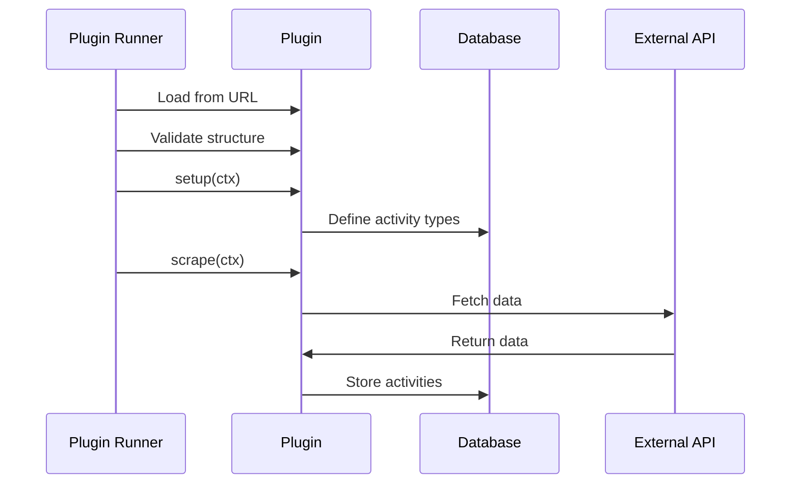

# Plugin System Overview

The Leaderboard system uses a plugin architecture to collect data from various sources without modifying core code.

## What is a Plugin?

A plugin is a JavaScript module that:

1. Defines activity types (e.g., "PR Merged", "Issue Opened")
2. Fetches data from an external source (API, database, etc.)
3. Stores activities in the leaderboard database

## Quick Start

Create a new plugin using the CLI tool:

```bash
pnpm create-leaderboard-plugin my-plugin
```

This generates a complete plugin project with TypeScript, tests, and documentation.

## Plugin Lifecycle



## Plugin Structure

Every plugin exports a default object implementing the `Plugin` interface:

```typescript
export default {
  name: 'my-plugin',
  version: '1.0.0',
  
  async setup(ctx) {
    // Optional: Initialize activity definitions
  },
  
  async scrape(ctx) {
    // Required: Fetch and store activities
  },
};
```

### Required Fields

- **name** (`string`): Unique plugin identifier
- **version** (`string`): Semantic version
- **scrape** (`function`): Main data collection method

### Optional Fields

- **setup** (`function`): Initialization and activity definition

## Plugin Context

Plugins receive a context object with useful utilities:

```typescript
interface PluginContext {
  db: Database;              // Database for storing data
  config: PluginConfig;      // Plugin-specific configuration
  orgConfig: OrgConfig;      // Organization information
  logger: Logger;            // Structured logging
}
```

### Database (`ctx.db`)

Use query helpers for type-safe database operations:

```typescript
import { activityQueries } from '@ohcnetwork/leaderboard-api';

await activityQueries.upsert(ctx.db, {
  slug: 'activity-123',
  contributor: 'username',
  activity_definition: 'pr_merged',
  title: 'Fixed bug',
  occured_at: new Date().toISOString(),
  link: 'https://github.com/...',
  text: null,
  points: null,
  meta: null,
});
```

Or execute raw SQL if needed:

```typescript
await ctx.db.execute('INSERT INTO activity (...) VALUES (...)', [params]);
```

### Configuration (`ctx.config`)

Access plugin-specific config from `config.yaml`:

```yaml
plugins:
  github:
    config:
      token: xxx
      org: myorg
```

```typescript
const { token, org } = ctx.config;
```

### Logger (`ctx.logger`)

Structured logging:

```typescript
ctx.logger.info('Fetching data', { source: 'github' });
ctx.logger.error('Failed to fetch', error, { retries: 3 });
```

## Plugin Distribution

Plugins are distributed as JavaScript files accessible via URL:

### Remote Plugins

```yaml
plugins:
  github:
    source: https://cdn.example.com/plugins/github.js
```

### Local Plugins

```yaml
plugins:
  custom:
    source: file:///absolute/path/to/plugin.js
```

### Plugin Hosting

Common hosting options:

- **GitHub Raw**: `https://raw.githubusercontent.com/user/repo/main/plugin.js`
- **CDN**: `https://cdn.jsdelivr.net/npm/package/plugin.js`
- **Self-hosted**: `https://your-domain.com/plugins/plugin.js`

## Example Plugins

### Minimal Plugin

```javascript
export default {
  name: 'hello-world',
  version: '1.0.0',
  
  async scrape(ctx) {
    ctx.logger.info('Hello from plugin!');
  },
};
```

### Activity Definition Plugin

```javascript
import {
  activityDefinitionQueries,
  activityQueries,
  contributorQueries,
} from '@ohcnetwork/leaderboard-api';

export default {
  name: 'github-activities',
  version: '1.0.0',
  
  async setup(ctx) {
    // Define activity types using query helpers
    await activityDefinitionQueries.insertOrIgnore(ctx.db, {
      slug: 'pr_opened',
      name: 'PR Opened',
      description: 'Opened a pull request',
      points: 5,
      icon: 'git-pull-request',
    });
    
    await activityDefinitionQueries.insertOrIgnore(ctx.db, {
      slug: 'pr_merged',
      name: 'PR Merged',
      description: 'Pull request merged',
      points: 10,
      icon: 'git-merge',
    });
    
    await activityDefinitionQueries.insertOrIgnore(ctx.db, {
      slug: 'issue_opened',
      name: 'Issue Opened',
      description: 'Opened an issue',
      points: 2,
      icon: 'circle-dot',
    });
  },
  
  async scrape(ctx) {
    const { token, org } = ctx.config;
    
    // Fetch repositories
    const response = await fetch(
      `https://api.github.com/orgs/${org}/repos`,
      {
        headers: { Authorization: `token ${token}` },
      }
    );
    
    const repos = await response.json();
    ctx.logger.info(`Found ${repos.length} repositories`);
    
    // Store activities using query helpers
    for (const repo of repos) {
      // Ensure contributor exists
      await contributorQueries.upsert(ctx.db, {
        username: repo.owner.login,
        name: repo.owner.name || null,
        role: null,
        title: null,
        avatar_url: repo.owner.avatar_url,
        bio: null,
        social_profiles: null,
        joining_date: null,
        meta: null,
      });
      
      // Insert activity
      await activityQueries.upsert(ctx.db, {
        slug: `pr-${repo.id}`,
        contributor: repo.owner.login,
        activity_definition: 'pr_merged',
        title: repo.name,
        occured_at: new Date().toISOString(),
        link: repo.html_url,
        text: null,
        points: null, // Uses default from activity_definition
        meta: null,
      });
    }
  },
};
```

## Plugin Best Practices

### 1. Use Query Helpers

Use the provided query helpers for type safety and convenience:

```typescript
import { activityQueries, activityDefinitionQueries, contributorQueries } from '@ohcnetwork/leaderboard-api';

// Insert or update (prevents duplicates automatically)
await activityQueries.upsert(ctx.db, activity);

// Or use raw SQL if needed
await ctx.db.execute(`
  INSERT OR IGNORE INTO activity (slug, ...) VALUES (?, ...)
`, [uniqueSlug, ...]);
```

### 2. Log Progress

Help users debug issues:

```typescript
ctx.logger.info(`Processing ${items.length} items`);
ctx.logger.debug('Item details', { item });
ctx.logger.error('Failed to process', error);
```

### 3. Handle Errors Gracefully

```typescript
try {
  await fetchData();
} catch (error) {
  ctx.logger.error('Failed to fetch', error);
  throw error; // Re-throw to fail the plugin
}
```

### 4. Use Batching

For many records, use transactions:

```typescript
const statements = items.map(item => ({
  sql: 'INSERT OR IGNORE INTO activity (...) VALUES (...)',
  params: [...],
}));

await ctx.db.batch(statements);
```

### 5. Validate Configuration

```typescript
async scrape(ctx) {
  if (!ctx.config.apiKey) {
    throw new Error('apiKey is required in plugin configuration');
  }
  
  // Proceed with scraping
}
```

## Plugin Security

### Validation

The plugin runner validates:
- Plugin structure (required fields)
- TypeScript types (via `@ohcnetwork/leaderboard-api`)

### Sandboxing

Currently, plugins run with full Node.js access. Future versions may add sandboxing.

### Trust

Only use plugins from trusted sources. Consider:
- Hosting your own plugins
- Code review before using third-party plugins
- Using signed/verified plugins (future feature)

## Next Steps

- [Creating Your First Plugin](/docs/plugins/creating-plugins)
- [Plugin API Reference](/docs/plugins/api-reference)
- [Example Plugins](https://github.com/ohcnetwork/leaderboard-plugins)

