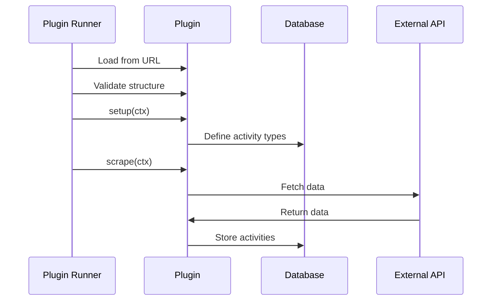

# Plugin System Overview

The Leaderboard system uses a plugin architecture to collect data from various sources without modifying core code.

## What is a Plugin?

A plugin is a JavaScript module that:

1. Defines activity types (e.g., "PR Merged", "Issue Opened")
2. Fetches data from an external source (API, database, etc.)
3. Stores activities in the leaderboard database

## Plugin Lifecycle



## Plugin Structure

Every plugin exports a default object implementing the `Plugin` interface:

```typescript
export default {
  name: 'my-plugin',
  version: '1.0.0',
  
  async setup(ctx) {
    // Optional: Initialize activity definitions
  },
  
  async scrape(ctx) {
    // Required: Fetch and store activities
  },
};
```

### Required Fields

- **name** (`string`): Unique plugin identifier
- **version** (`string`): Semantic version
- **scrape** (`function`): Main data collection method

### Optional Fields

- **setup** (`function`): Initialization and activity definition

## Plugin Context

Plugins receive a context object with useful utilities:

```typescript
interface PluginContext {
  db: Database;              // Database for storing data
  config: PluginConfig;      // Plugin-specific configuration
  orgConfig: OrgConfig;      // Organization information
  logger: Logger;            // Structured logging
}
```

### Database (`ctx.db`)

Execute SQL queries:

```typescript
await ctx.db.execute('INSERT INTO activity (...) VALUES (...)', [params]);
```

### Configuration (`ctx.config`)

Access plugin-specific config from `config.yaml`:

```yaml
plugins:
  github:
    config:
      token: xxx
      org: myorg
```

```typescript
const { token, org } = ctx.config;
```

### Logger (`ctx.logger`)

Structured logging:

```typescript
ctx.logger.info('Fetching data', { source: 'github' });
ctx.logger.error('Failed to fetch', error, { retries: 3 });
```

## Plugin Distribution

Plugins are distributed as JavaScript files accessible via URL:

### Remote Plugins

```yaml
plugins:
  github:
    source: https://cdn.example.com/plugins/github.js
```

### Local Plugins

```yaml
plugins:
  custom:
    source: file:///absolute/path/to/plugin.js
```

### Plugin Hosting

Common hosting options:

- **GitHub Raw**: `https://raw.githubusercontent.com/user/repo/main/plugin.js`
- **CDN**: `https://cdn.jsdelivr.net/npm/package/plugin.js`
- **Self-hosted**: `https://your-domain.com/plugins/plugin.js`

## Example Plugins

### Minimal Plugin

```javascript
export default {
  name: 'hello-world',
  version: '1.0.0',
  
  async scrape(ctx) {
    ctx.logger.info('Hello from plugin!');
  },
};
```

### Activity Definition Plugin

```javascript
export default {
  name: 'github-activities',
  version: '1.0.0',
  
  async setup(ctx) {
    // Define activity types
    await ctx.db.execute(`
      INSERT OR IGNORE INTO activity_definition 
      (slug, name, description, points, icon)
      VALUES 
      ('pr_opened', 'PR Opened', 'Opened a pull request', 5, 'git-pull-request'),
      ('pr_merged', 'PR Merged', 'Pull request merged', 10, 'git-merge'),
      ('issue_opened', 'Issue Opened', 'Opened an issue', 2, 'circle-dot')
    `);
  },
  
  async scrape(ctx) {
    const { token, org } = ctx.config;
    
    // Fetch pull requests
    const response = await fetch(
      `https://api.github.com/orgs/${org}/repos`,
      {
        headers: { Authorization: `token ${token}` },
      }
    );
    
    const repos = await response.json();
    ctx.logger.info(`Found ${repos.length} repositories`);
    
    // Store activities (simplified)
    for (const repo of repos) {
      await ctx.db.execute(`
        INSERT OR IGNORE INTO activity
        (slug, contributor, activity_definition, title, occured_at, link, points)
        VALUES (?, ?, ?, ?, ?, ?, ?)
      `, [
        `pr-${repo.id}`,
        repo.owner.login,
        'pr_merged',
        repo.name,
        new Date().toISOString(),
        repo.html_url,
        10,
      ]);
    }
  },
};
```

## Plugin Best Practices

### 1. Use INSERT OR IGNORE

Prevent duplicate activities:

```typescript
await ctx.db.execute(`
  INSERT OR IGNORE INTO activity (slug, ...) VALUES (?, ...)
`, [uniqueSlug, ...]);
```

### 2. Log Progress

Help users debug issues:

```typescript
ctx.logger.info(`Processing ${items.length} items`);
ctx.logger.debug('Item details', { item });
ctx.logger.error('Failed to process', error);
```

### 3. Handle Errors Gracefully

```typescript
try {
  await fetchData();
} catch (error) {
  ctx.logger.error('Failed to fetch', error);
  throw error; // Re-throw to fail the plugin
}
```

### 4. Use Batching

For many records, use transactions:

```typescript
const statements = items.map(item => ({
  sql: 'INSERT OR IGNORE INTO activity (...) VALUES (...)',
  params: [...],
}));

await ctx.db.batch(statements);
```

### 5. Validate Configuration

```typescript
async scrape(ctx) {
  if (!ctx.config.apiKey) {
    throw new Error('apiKey is required in plugin configuration');
  }
  
  // Proceed with scraping
}
```

## Plugin Security

### Validation

The plugin runner validates:
- Plugin structure (required fields)
- TypeScript types (via `@leaderboard/plugin-api`)

### Sandboxing

Currently, plugins run with full Node.js access. Future versions may add sandboxing.

### Trust

Only use plugins from trusted sources. Consider:
- Hosting your own plugins
- Code review before using third-party plugins
- Using signed/verified plugins (future feature)

## Next Steps

- [Creating Your First Plugin](/docs/plugins/creating-plugins)
- [Plugin API Reference](/docs/plugins/api-reference)
- [Example Plugins](https://github.com/ohcnetwork/leaderboard-plugins)

